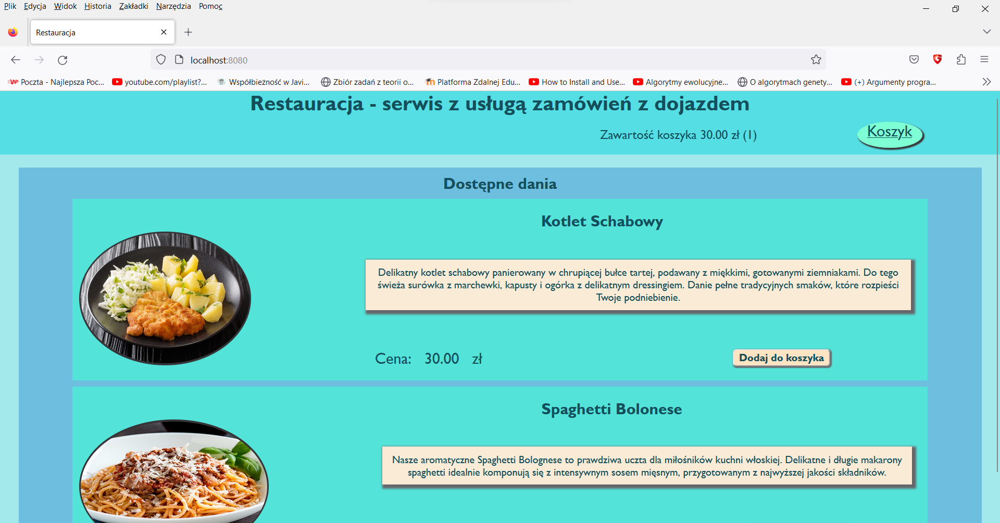
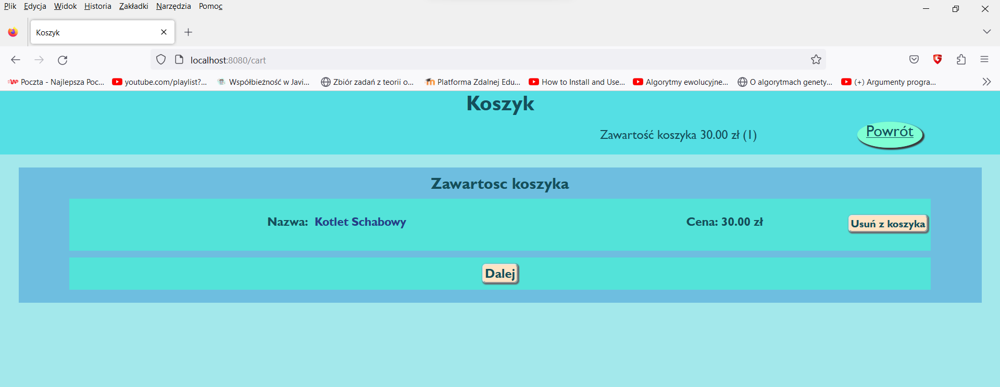
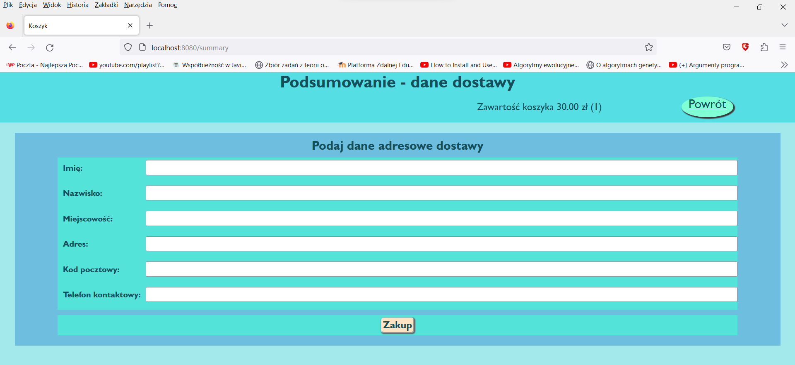
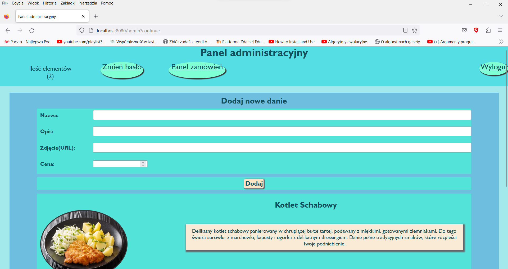
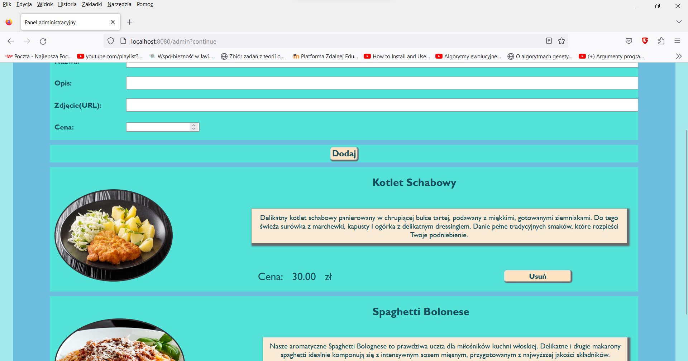
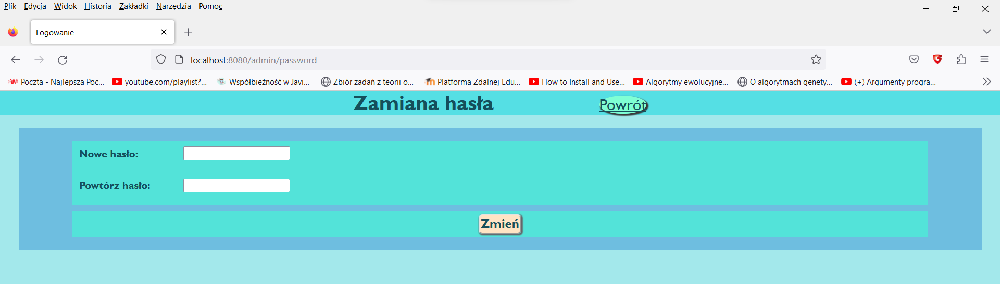
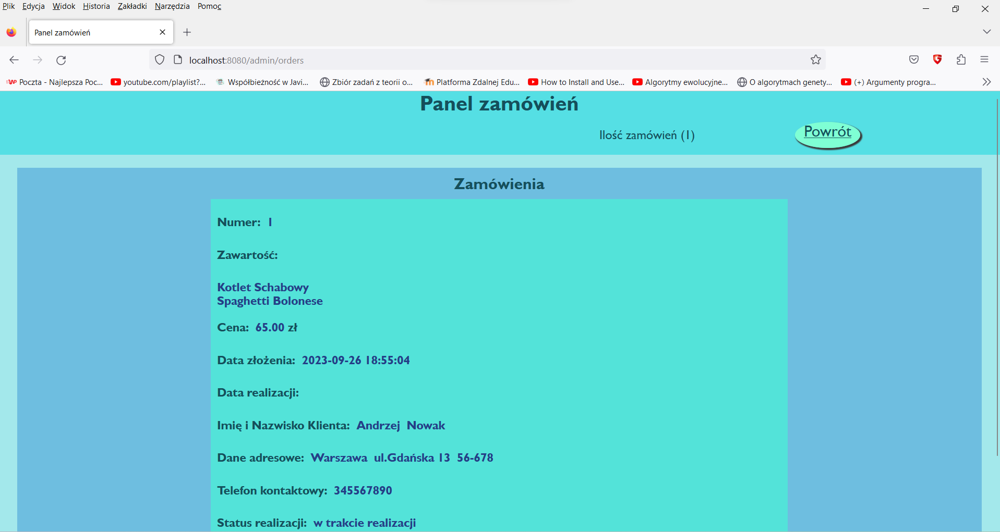

# Web Restaurant - A Spring Boot Web-Order Service Simulation

Welcome to Web Restaurant, a simulated web-order service application written in Java using the Spring Boot framework. This project allows customers to place orders by choosing from a selection of available meals. Additionally, there's an admin portal for managing orders and the restaurant's menu. The application was written in polish.

## 🚀 About Me

Hello, I'm Michał Wieczorek, a Computer Science student at the Silesian University of Technology in Poland. I am eager to kickstart my career in the tech industry and currently exploring employment and apprenticeship opportunities.

## Program Functions

### Customer
- Place orders by selecting meals available on the website and providing contact information.

### Admin
- Manage customer orders, including changing order status (e.g., DONE, UNDONE).
- Add or remove meals from the menu.
- Change the admin page's login password.

## Screenshots

### Here are some screenshots of the application:
- 
- 
- 
- 
- 
- 
- 
- 

## Run Locally

Follow these steps to run the application locally:

1. **Clone the project:**
   ```bash
   git clone https://github.com/mw301883/Web-Restaurant--
   ```
2. **Navigate the executable file in folder "out":**
   ```bash
   restaurantservice.jar
   ```
3. **Access the application through the following URL in your browser:**
   ```bash
   http://localhost:8080/
   ```
4. **For admin functionalities, log in using the below URL:**
   ```bash
   http://localhost:8080/admin
   ```
   **Default login credentials:**

    Login: admin  
    Password: password
5. **If you want to see the Data Base you can easily get access to the H2-console panel using this URL (password to log in is "password"):**
   ```bash
   http://localhost:8080/h2-console/
   ```
## Tech Stack

**Languages:** Java, HTML, CSS

**Frameworks:** Spring Boot, Spring Security, Hibernate (H2 DataBase), Thymleaf
