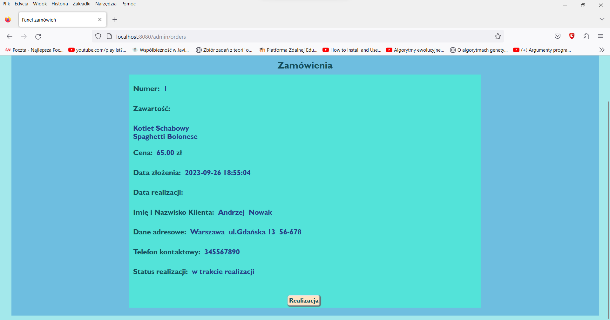

# Web-Restaurant--
REST app project written in Java with Spring Boot framework. The program is simulating restaurant Web-Order Service, where customers are able to make orders consisting from on page avaible meals.
I also ensured admin page which you can get access after successful signing in. Admin is able to add/remove meal from the customer offer and have access to managing all orders. 
This is only the simulation so I used the H2 Data Base which only store data in memory during program running. 
Source code is placed on Master Branch.   


## 🚀 About Me
Hi, my name is Michał  Wieczorek I'm a student of Silesian Univeristy of Technology in Poland. I am studing Computer Sciencie and currently looking for first employment/apprenticeship.


## Program Functions

#Customer
- making orders (choosing specified meals avaible on page and entering contact datas)
#Admin
- managing customer's orders (changing status of order - DONE/UNDONE)
- adding/removing  meals from the offer
- changing password to sign in the admin page


## Screenshots

&nbsp;&nbsp;&nbsp;&nbsp;&nbsp;&nbsp;&nbsp;&nbsp;&nbsp;&nbsp;&nbsp;&nbsp;&nbsp;&nbsp;&nbsp;&nbsp;&nbsp;&nbsp;&nbsp;&nbsp;&nbsp;&nbsp;
&nbsp;&nbsp;&nbsp;&nbsp;&nbsp;&nbsp;&nbsp;&nbsp;&nbsp;&nbsp;&nbsp;&nbsp;&nbsp;&nbsp;&nbsp;&nbsp;&nbsp;&nbsp;&nbsp;&nbsp;&nbsp;&nbsp;
&nbsp;&nbsp;&nbsp;&nbsp;&nbsp;&nbsp;&nbsp;&nbsp;&nbsp;&nbsp;&nbsp;&nbsp;&nbsp;&nbsp;&nbsp;&nbsp;&nbsp;&nbsp;&nbsp;&nbsp;&nbsp;&nbsp;
&nbsp;&nbsp;&nbsp;&nbsp;&nbsp;&nbsp;&nbsp;&nbsp;&nbsp;&nbsp;&nbsp;&nbsp;&nbsp;&nbsp;&nbsp;&nbsp;&nbsp;&nbsp;&nbsp;&nbsp;&nbsp;&nbsp;
&nbsp;&nbsp;&nbsp;&nbsp;&nbsp;&nbsp;&nbsp;&nbsp;&nbsp;&nbsp;&nbsp;&nbsp;&nbsp;&nbsp;&nbsp;&nbsp;&nbsp;&nbsp;&nbsp;&nbsp;&nbsp;&nbsp;
&nbsp;&nbsp;&nbsp;&nbsp;&nbsp;&nbsp;&nbsp;&nbsp;&nbsp;&nbsp;&nbsp;&nbsp;&nbsp;&nbsp;&nbsp;&nbsp;&nbsp;&nbsp;&nbsp;&nbsp;&nbsp;&nbsp;
&nbsp;&nbsp;&nbsp;&nbsp;&nbsp;&nbsp;&nbsp;&nbsp;&nbsp;&nbsp;&nbsp;&nbsp;&nbsp;&nbsp;&nbsp;&nbsp;&nbsp;&nbsp;&nbsp;&nbsp;&nbsp;&nbsp;
## Run Locally

Clone the project

```bash
  https://github.com/mw301883/Web-Restaurant--
```

Go to the Release file

```bash
  run executable file Snake_Game.exe
```

When the application is running it is avaible in below URL in your browser
```bash
  http://localhost:8080/
```
To get the admin functions you need to log in at below URL
```bash
  http://localhost:8080/admin
```
#default signing datas: 
Login: admin 
Password: password

## Tech Stack

**Languages:** Java, HTML, CSS

**Frameworks:** Spring Boot, Spring Security, Hibernate (H2 DataBase), Thymleaf     
